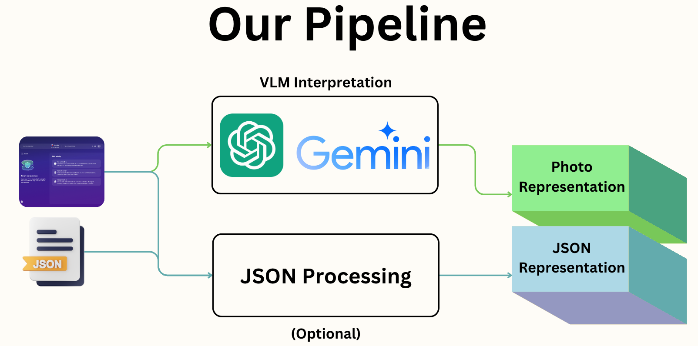

# ЛушКузГумШик IASA Hackathon

As for this hackathon, we had a task of creating text representations of UI interfaces, that would be sufficient to give answer for questions, that are used for accesibility. That is important for everyday use of apps at your gadgets, which is an essential task to grant every person easy access to technologies.

Our solution uses VLM models (GPT4-V or Gemini) to let us create such representations. We prompt our model with a photo and prompt, that asks it to describe the UI elements in detail. We suggest, that for our task it is a way, that may provide us with context, information about UI elements and other things, that would let us to answer the questions.

Besides, as we granted with .json files of accesibility, we can use them to improve our representations. We simplify that with use of images to get rid of noisyness and we store into tsv file for more token-eficient. We simply stack both representations, with inserting line, that says, that those representations are linked.

All our results are stored in folder results. Our final results for test split is stored in folder results/gpt4_final_tsv

We realised Gemini and GPT4-V realisation, but we recommend use GPT4-V, as it has much better results. To execute files, you have to first create photo representaitons with use of gpt4/runner.py, then connect with preprocessed .json files, that are stored in .tsv files, and that would give you final representation.

If you want to test those representations with questions from dataset, you can use test-suite/test_solution.py